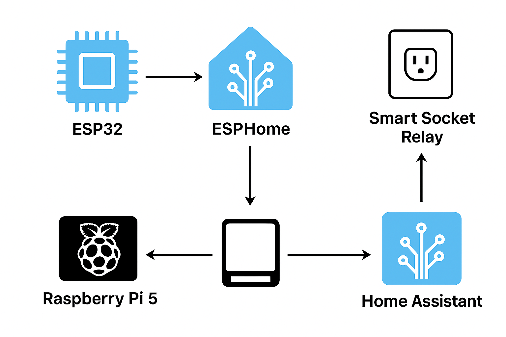
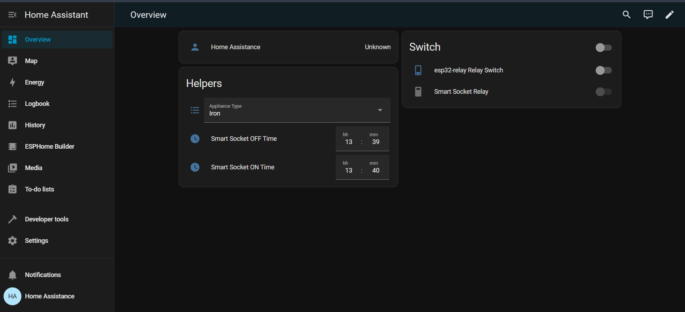
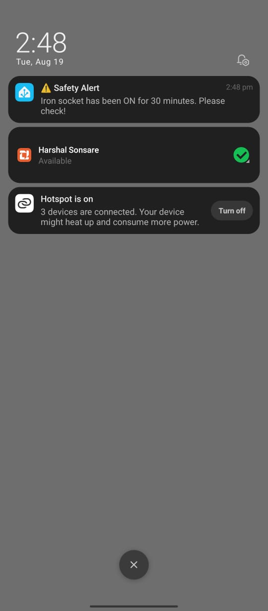

# MECHATRONS_HTH_2k25
# 🏠 Smart Home Automation with ESP32, ESPHome & Home Assistant  

## 📌 Overview  
This project demonstrates a **smart home automation system** using **ESP32 microcontrollers with relays** as nodes and a **Raspberry Pi 5 running Home Assistant** as the central hub.  
The ESP32 boards are programmed with **ESPHome**, allowing seamless integration with Home Assistant for monitoring, controlling, and automating home appliances.  

Our goal is to provide a **low-cost, scalable, and open-source solution** for smart homes without depending on expensive proprietary systems.  

---

## 🔧 Features  
- ✅ Control appliances (lights, fans, switches) via **Home Assistant Dashboard**  
- ✅ Real-time status monitoring  
- ✅ Automation rules & scheduling (e.g., lights on at sunset)  
- ✅ Local control (no cloud dependency)  
- ✅ Expandable with more ESP32 relay nodes  
- ✅ Works with voice assistants (Google Assistant / Alexa) if enabled  
- ✅ **Smart Notifications**: Receive alerts on your phone when appliances (e.g., iron, heater) are left ON for too long  

---

## 🏗️ System Architecture  
  

---

## 📲 Screenshots  

### 🔘 Dashboard Control  
  

### 📱 Mobile Notification Example  
  

---

## 📂 Project Structure 
├── ESPHome/ # ESP32 YAML configs
│ └── esp32_relay.yaml
├── HomeAssistant/ # Automations & scripts
│ └── iron_notification.yaml
├── docs/ # Documentation & screenshots
│ ├── architecture.png
│ ├── dashboard.png
│ └── mobile_notification.png
└── README.md

---

## 🚀 Getting Started  

1. Flash ESP32 with **ESPHome firmware** (`esp32_relay.yaml`).  
2. Add ESPHome device to **Home Assistant**.  
3. Copy automation YAML (`iron_notification.yaml`) to Home Assistant `automations.yaml`.  
4. Update your phone notification service under **Developer Tools → Services**.  
5. Restart Home Assistant and test!  

---

## 🙌 Contribution  
Pull requests are welcome! Please fork the repo and create a new branch for your features/fixes.  

---

## 📜 License  
This project is open-source under the **MIT License**.  

